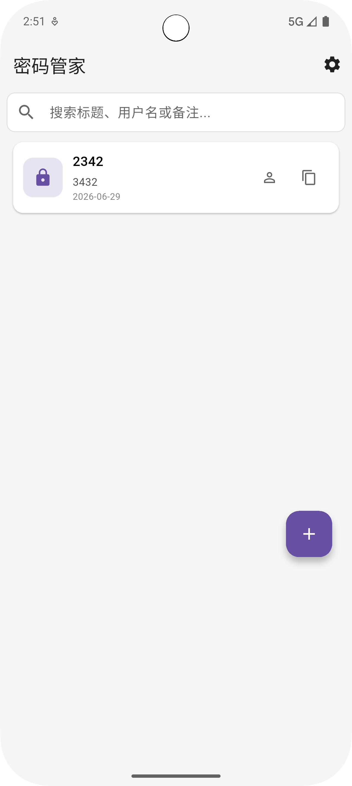
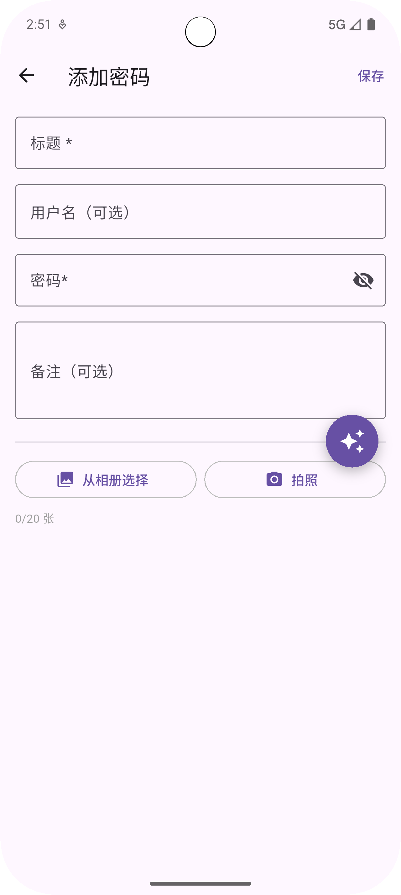
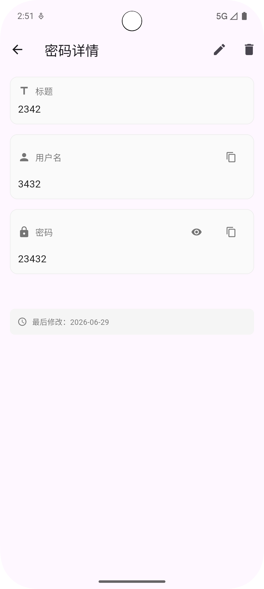

# 密码管理器

一个完全离线的、安全的密码管理器 Flutter 应用。

[](https://flutter.dev)

---

## 📱 截图

| 解锁页 | 密码列表 | 添加密码 | 详情页 |
|--------|---------|---------|--------|
|  |  |  |  |

---

## ✨ 功能特性

### 🔐 安全体系
- **主密码保护**：PBKDF2（20万次迭代）+ SHA-256 密钥派生
- **AES-256-GCM 加密**：所有数据（密码、图片）均使用行业标准加密
- **多因子解锁**：主密码 / 手势图案 / 生物识别（指纹/人脸）
- **恢复密钥**：128位十六进制密钥，忘记主密码时可用

### 📝 密码管理
- 添加/编辑/删除密码条目
- 支持标题、用户名、密码、备注
- 实时搜索（标题/用户名/备注）
- 一键复制用户名和密码

### 🖼️ 图片功能
- 每条目最多添加 20 张图片
- 从相册选择 / 拍照添加
- 自动生成缩略图（200x200）
- 图片压缩选项（原图 / 高 / 中）
- 全屏图片查看器（支持缩放）

### 🔄 备份与恢复
- 导出加密备份文件（包含密码和图片）
- 从备份文件恢复数据
- 恢复密钥验证保护

### 🎨 个性化
- 深色模式（跟随系统 / 手动切换）
- 自定义背景图（密码列表页）
- 背景模糊度 / 卡片透明度调节
- 文字颜色自定义

---

## 🏗️ 技术架构

| 模块 | 技术 |
|------|------|
| UI 框架 | Flutter |
| 状态管理 | Riverpod |
| 数据库 | SQLite (sqflite) |
| 加密 | AES-256-GCM (pointycastle) |
| 安全存储 | flutter_secure_storage |
| 生物识别 | local_auth |
| 图片处理 | image_picker + image |
| 图片查看 | photo_view |

### 加密方案

```
主密码 → PBKDF2(SHA-256, 200000轮) → masterKey (32字节)
         ↓
     AES-256-GCM
         ↓
    密码 / 图片 / 备份 全部加密存储
```

### 数据流向

```
┌─────────────────────────────────────────────────────────────┐
│                      应用层 (UI)                            │
└─────────────────────────────────────────────────────────────┘
                              │
                              ▼
┌─────────────────────────────────────────────────────────────┐
│                     Riverpod 状态管理                       │
│         authProvider / passwordProvider / settingsProvider  │
└─────────────────────────────────────────────────────────────┘
                              │
                              ▼
┌─────────────────────────────────────────────────────────────┐
│                      加密层 (AES-256-GCM)                   │
└─────────────────────────────────────────────────────────────┘
                              │
              ┌───────────────┼───────────────┐
              ▼               ▼               ▼
       ┌──────────┐   ┌──────────────┐   ┌──────────┐
       │  SQLite  │   │ 本地文件系统  │   │Secure    │
       │ (密码)   │   │ (加密图片)   │   │Storage   │
       └──────────┘   └──────────────┘   └──────────┘
```

---

## 📂 项目结构

```
lib/
├── app.dart                    # 应用入口 & 路由配置
├── main.dart                   # 启动入口
│
├── constants/
│   └── app_constants.dart      # 全局常量
│
├── core/
│   ├── crypto/                 # 加密模块
│   │   ├── aes_gcm.dart        # AES-256-GCM 加解密
│   │   ├── pbkdf2.dart         # PBKDF2 密钥派生
│   │   └── random.dart         # 安全随机数
│   ├── models/                 # 数据模型
│   │   ├── password_entry.dart
│   │   └── image_model.dart
│   ├── storage/                # 存储层
│   │   ├── database.dart       # SQLite 操作
│   │   ├── secure_storage.dart # 加密存储
│   │   └── shared_prefs.dart   # 偏好设置
│   ├── services/               # 服务层
│   │   ├── biometric_service.dart
│   │   ├── image_service.dart
│   │   ├── backup_service.dart
│   │   └── permission_service.dart
│   └── widgets/                # 公共组件
│       ├── no_back_page.dart
│       ├── no_back_stateful_page.dart
│       ├── background_scaffold.dart
│       └── gesture_pattern_view.dart
│
├── pages/                      # 页面
│   ├── unlock/
│   │   └── unlock_page.dart
│   ├── setup/
│   │   ├── setup_master_password_page.dart
│   │   ├── setup_mnemonic_page.dart
│   │   ├── setup_gesture_page.dart
│   │   └── setup_biometric_page.dart
│   ├── home/
│   │   ├── password_list_page.dart
│   │   └── password_detail_page.dart
│   ├── add_edit/
│   │   └── add_edit_page.dart
│   └── settings/
│       ├── settings_page.dart
│       ├── about_page.dart
│       ├── background_settings_page.dart
│       └── biometric_setup.dart
│
├── providers/                  # Riverpod 状态
│   ├── auth_provider.dart
│   ├── password_provider.dart
│   └── settings_provider.dart
│
└── utils/                      # 工具类
    ├── helpers.dart
    └── toast_utils.dart
```

---

## 🚀 快速开始

### 环境要求
- Flutter 3.x
- Android SDK / iOS SDK

### 安装

```bash
# 克隆仓库
git clone https://github.com/mengzun999/password_manager.git
cd password_manager

# 安装依赖
flutter pub get

# 运行应用
flutter run
```

### 构建

```bash
# Android
flutter build apk --release

# iOS
flutter build ios --release
```

---

## 📄 许可证

本项目仅供个人学习、二改自用，**禁止商用**。

```
Copyright (c) 2026 梦尊

本软件仅供个人学习研究使用，禁止用于任何商业目的。
未经作者明确书面许可，不得将本软件或其衍生作品用于商业用途。
```

如需商用授权，请联系作者。

---

## 👤 作者

**梦尊**

- GitHub: [@mengzun999](https://github.com/mengzun999)

---

## 🙏 致谢

- [Flutter](https://flutter.dev) - UI 框架
- [pointycastle](https://pub.dev/packages/pointycastle) - 加密库
- [Riverpod](https://riverpod.dev) - 状态管理
- 所有使用的开源库

---

## ⭐ Star History

如果这个项目对你有帮助，欢迎 Star ⭐ 支持！

[](https://star-history.com/#mengzun999/password_manager&Date)

---

## 🔗 相关链接

- [Flutter 官方文档](https://docs.flutter.dev/)
- [项目发布页面](https://github.com/mengzun999/password_manager/releases)
